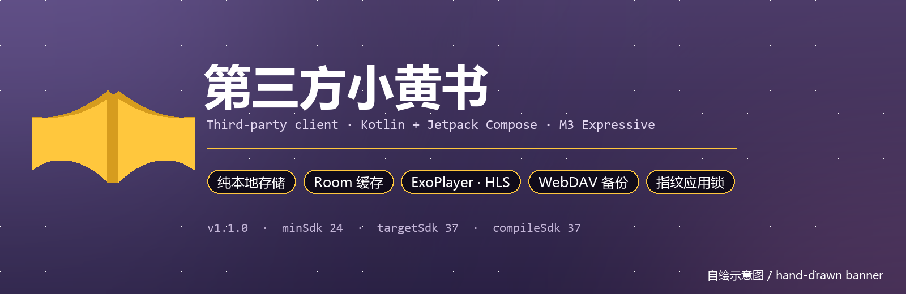
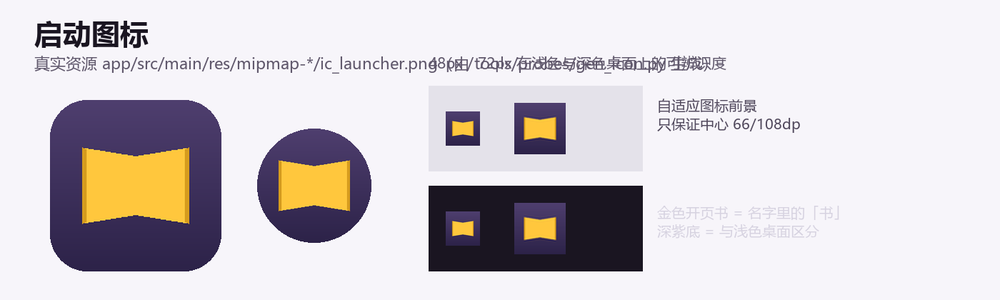
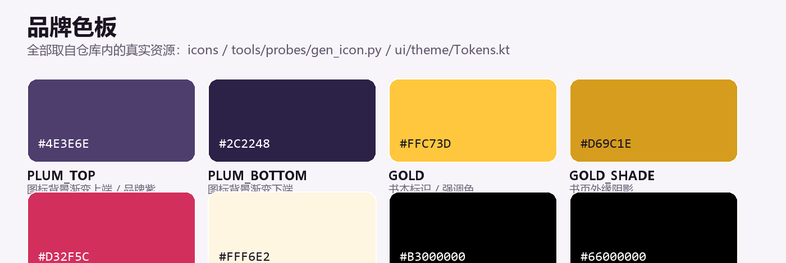

<div align="center">



<br>


**纯 Kotlin + Jetpack Compose 的 Android 客户端**　·　无 XML 布局　·　M3 Expressive　·　内容全部缓存在本机

</div>

---

> ### ⚠️ 先看这里
>
> 本项目是**个人学习性质的第三方客户端**，用于研究 Android 客户端工程实践（Compose 架构、HLS 播放器、本地
> 缓存与备份、协议互操作性）。
>
> - 仓库内**不包含**任何内容数据、官方安装包、反编译产物或界面截图；所有请求都由使用者**自己的账号**发起。
> - 不破解付费、不绕过任何访问控制、不提供任何内容。若某接口返回受限内容，客户端只做展示，不做规避。
> - 「小黄书」相关商标与内容版权归其各自权利人所有，本项目与之无关联。若权利人反对，请提 Issue，仓库会立即下架。

---

## 目录

- [这是什么](#这是什么)
- [功能](#功能)
- [品牌资产](#品牌资产)
- [快速开始](#快速开始)
- [项目结构](#项目结构)
- [技术栈](#技术栈)
- [版本号与交付物](#版本号与交付物)
- [文档地图](#文档地图)
- [面向 AI 的档案](#面向-ai-的档案)
- [贡献](#贡献)
- [许可](#许可)

## 这是什么

一个用 **Jetpack Compose 从零重写**的第三方客户端：没有 XML 布局、没有 `appcompat`／`material` 依赖，
UI 全部由 Compose 组合函数构成，主题基于 **Material 3 Expressive**（`MaterialExpressiveTheme` +
`MotionScheme.expressive()`）。

工程上是**有意做成"可维护的现代 Android 样板"**的项目，因此把几件常被忽略的事做全了：

| 关注点 | 做法 |
| --- | --- |
| 单一数据源 | `data/XhsRepository.kt` 收口所有读写，Room 缓存 + 网络回填，UI 不直接碰网络 |
| 全链路加密 | 请求/响应包体 AES/CBC 加密（密钥来自对官方客户端的静态分析，见 [docs/PROTOCOL.md](docs/PROTOCOL.md)） |
| 可离线 | 收藏、最近浏览、关注列表存 Room（`xhs_local.db`），断网仍可浏览已缓存内容 |
| 可带走 | 备份/恢复支持本地文件与 WebDAV（固定放在 `xhs/` 子目录） |
| 隐私 | 应用锁走 `androidx.biometric`；备份默认不含账号凭据 |
| 可复现构建 | 自签名 keystore 入库，`versionCode` 由时间戳推导，任何人都能构建出可覆盖安装的 release 包 |

## 功能

**浏览**

- 推荐流：全屏短视频，预加载相邻作品，滑动即起播，暂停指示反映真实播放状态
- 发现页：顶部分类 + 左右滑动分类 pager，瀑布流按封面真实比例排布（不再伪造高度）
- 搜索：作品与作者双通道，搜索历史可一键清空
- 详情页：图文（多图画廊 + 全屏查看 + 双指缩放）／视频（内嵌播放器 + 全屏 + 续播）
- 评论区：一级评论 + 嵌套回复，二级回复点开对话框看完整上下文，按真实总数判断"查看更多"
- 作者页：作品 / 关注 / 粉丝三个入口，关注状态跨页同步

**本地**

- 收藏与最近浏览：一键清空（含二次确认），最近浏览上限可配
- 播放器：HLS（media3），缓冲进度与百分比、弱网/超长视频跳转自愈、播放器交接（推荐页 → 详情页共用同一实例）
- 备份与恢复：本地文件 / WebDAV，WebDAV 带"测试连接"，备份内容经过审计（含设置与搜索记录）

**应用**

- 主题：跟随系统深浅色，API 31+ 从壁纸动态取色，回退到品牌紫金配色
- 应用锁：指纹/人脸解锁开关
- 设置：音量键翻页、锁屏行为、缓冲提示、最近浏览上限
- 深链：`xhstp://note/<id>` 直达作品

## 品牌资产





- 图标为自适应图标：金色开页书前景（只占中心安全区）+ 深紫渐变背景，`tools/probes/gen_icon.py` 可重新生成全部密度。
- 色板全部取自仓库内真实资源（`app/src/main/res`、`ui/theme/Tokens.kt`、`tools/probes/gen_icon.py`）。
- 上图与本 README 的横幅、架构图均为**脚本自绘**（[tools/make_readme_assets.py](tools/make_readme_assets.py)），
  不是应用截图；开发期的实机截图按约定不入库。

## 快速开始

需要 **JDK 17** 与 **Android SDK**（`compileSdk 37`）。完整说明见 [docs/BUILD.md](docs/BUILD.md)。

```bash
# 1. 指向本机 SDK（该文件不入库）
cp local.properties.example local.properties   # 然后按需修改 sdk.dir

# 2. 构建 debug 包（首次会下载 Gradle 9.8.0 与依赖，约 1–2 分钟）
./gradlew assembleDebug            # Windows: gradlew.bat assembleDebug

# 3. 装到设备/模拟器
adb install -r app/build/outputs/apk/debug/app-debug.apk
adb shell am force-stop com.thirdparty.xhs.debug
adb shell am start -n com.thirdparty.xhs.debug/com.thirdparty.xhs.MainActivity
```

- 包名：release `com.thirdparty.xhs`，debug `com.thirdparty.xhs.debug`（可并存安装，数据互不影响）。
- release：`./gradlew assembleRelease`（R8 + 资源压缩 + `keystore/release.jks` 签名）。
- 仓库路径含中文时依赖 `android.overridePathCheck=true`（已在 `gradle.properties` 中开启）。

## 项目结构

```
xhs-thirdparty/
├── app/                       # 唯一 Gradle 模块
│   ├── build.gradle           # 版本号 / 签名 / buildConfigField / 依赖矩阵
│   └── src/main/
│       ├── AndroidManifest.xml
│       ├── java/com/thirdparty/xhs/
│       │   ├── data/          # 仓库层 + Room（实体 / DAO / 备份）
│       │   ├── net/           # OkHttp + AES 加解密 + WebDAV + 凭据
│       │   ├── navigation/    # 路由注册
│       │   ├── ui/screens/    # 各页面（纯 Compose）
│       │   ├── ui/components/ # 可复用组件（瀑布流 / 播放器 / 画廊 / 对话框…）
│       │   ├── ui/viewmodel/  # 各页 ViewModel
│       │   └── ui/theme/      # M3 Expressive 主题与设计令牌
│       └── res/               # 仅图标与基础资源（无布局 XML）
├── docs/                      # 文档（含面向 AI 的档案 docs/ai/）
├── keystore/release.jks       # 自签名 release 密钥（刻意入库，见 BUILD.md）
├── tools/                     # 本机验证与资源生成脚本（verify.ps1 / 图标生成 / README 素材）
├── .github/                   # CI、Issue/PR 模板、Copilot 指令
└── .cursor/rules/             # Cursor 项目规则
```

## 技术栈

| 层 | 选型 | 版本 |
| --- | --- | --- |
| 语言 | Kotlin（无 Java 源码） | 2.1.21 |
| UI | Jetpack Compose（BOM） | 2026.02.01 |
| 设计系统 | material3（**刻意高于 BOM**：M3 Expressive 只在 alpha 线公开） | 1.5.0-alpha29 |
| 构建 | AGP / Gradle / KSP | 9.4.1 / 9.8.0 / 2.1.21-2.0.2 |
| 导航 | navigation-compose | 2.9.5 |
| 持久化 | Room（KSP 生成） | 2.8.5 |
| 网络 | OkHttp（+ `org.json`，无 gson） | 5.1.0 |
| 播放 | media3 ExoPlayer + HLS + UI | 1.11.1 |
| 加密 | `javax.crypto` AES/CBC/PKCS5Padding | JDK 17 |
| 生物识别 | biometric + fragment-ktx（≥1.8.9 为硬约束） | 1.1.0 / 1.8.9 |
| 协程 | kotlinx-coroutines-android | 1.11.0 |
| SDK | minSdk 24 / targetSdk 37 / compileSdk 37 | — |

## 版本号与交付物

三件事刻意分开（细节与理由见 [docs/BUILD.md](docs/BUILD.md)）：

| 名称 | 值 | 说明 |
| --- | --- | --- |
| `versionName` | `1.1.0` | 给人看的，按功能批次手动推进 |
| `versionCode` | `当前秒数 − 2026-10-01T00:00:00 的秒数` | 时间驱动、单调递增，且落在 32 位有符号整数内 |
| `Client-Version` 头 | `2.6.0` | 与服务端对齐的**协议版本**，不要跟着 App 版本改 |

构建产物不入库。最近一次本机实测：`assembleDebug` 成功（2026-10-04，Gradle 9.8.0 / AGP 9.4.1 / JDK 17）。

## 文档地图

| 文档 | 内容 |
| --- | --- |
| [docs/ARCHITECTURE.md](docs/ARCHITECTURE.md) | 分层、代码地图、Room 与导航、主题与设计令牌、设计取舍 |
| [docs/PROTOCOL.md](docs/PROTOCOL.md) | 接口清单、请求头、AES 参数、包体结构、合规声明 |
| [docs/BUILD.md](docs/BUILD.md) | 环境要求、构建命令、签名、依赖矩阵、常见构建问题 |
| [docs/VERIFY.md](docs/VERIFY.md) | 设备验证回路：安装校验、UI 取证、夹具注入、干扰项排查 |
| [docs/CHANGELOG.md](docs/CHANGELOG.md) | 按开发阶段整理的变更记录（由 git 历史生成） |


## 面向 AI 的档案

仓库把"给 AI 用的上下文"当作一等公民独立维护，**与项目文档分离**：

| 文件 | 作用 |
| --- | --- |
| [AGENTS.md](AGENTS.md) | **入口**：硬约束、仓库地图、务必执行的命令、变更流程、汇报格式 |
| [CLAUDE.md](CLAUDE.md) | 极简指针（Claude Code 等读取 `CLAUDE.md` 的工具） |
| [docs/ai/CONTEXT.md](docs/ai/CONTEXT.md) | 一页速览：定位、数据流、协议摘要、环境事实、当前状态 |
| [docs/ai/CONVENTIONS.md](docs/ai/CONVENTIONS.md) | 代码、提交、文档、命名约定 |
| [docs/ai/GOTCHAS.md](docs/ai/GOTCHAS.md) | 规则化的踩坑清单（每条含触发条件与正确做法） |
| [docs/ai/PROMPTS.md](docs/ai/PROMPTS.md) | 可直接复用的任务提示词模板 |
| [.github/copilot-instructions.md](.github/copilot-instructions.md) | GitHub Copilot 指令 |
| [.cursor/rules/project.mdc](.cursor/rules/project.mdc) | Cursor 项目规则 |

约定：修改代码、构建配置或文档结构时，**同步更新 AI 档案**（尤其是 `docs/ai/GOTCHAS.md` 与 `AGENTS.md` 的仓库地图）。

## 贡献

1. 改代码前先读 [AGENTS.md](AGENTS.md)（含不可动的硬约束）。
2. 一次提交只做一件事；提交信息用中文，前缀 `feat:` / `fix:` / `perf:` / `refactor:` / `docs:` / `chore:` / `build:`。
3. 提交前必须本机编译通过：`./gradlew assembleDebug`。
4. UI 改动要给出实机证据（截图或 UI dump 文本），不接受"看起来好了"。
5. 不提交 APK、截图、反编译产物与本机配置（`.gitignore` 已覆盖）。

## 许可

代码以 [MIT](LICENSE) 许可发布。第三方库各自遵循其原始许可；「小黄书」名称、图标风格与内容版权归原权利人。
