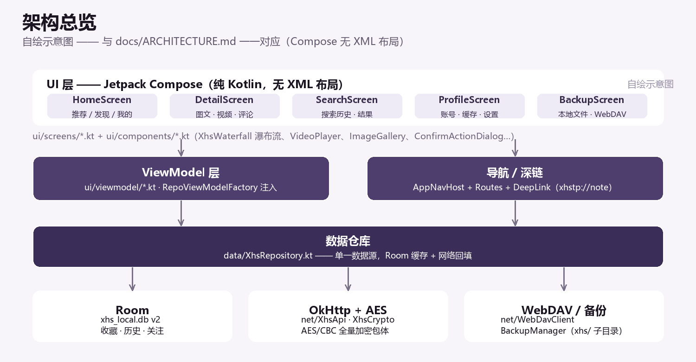

# 架构

本文说明**分层、代码地图、数据流、设计令牌与取舍**。面向"要改这个仓库的人（或 AI）"。
AI 专用的速览版在 [ai/CONTEXT.md](ai/CONTEXT.md)；踩坑规则在 [ai/GOTCHAS.md](ai/GOTCHAS.md)。



## 1. 分层

```
┌──────────────────────────────────────────────────────────────┐
│ UI 层      ui/screens/*  +  ui/components/*                  │
│            Jetpack Compose，无 XML 布局；只消费状态、派发事件   │
├──────────────────────────────────────────────────────────────┤
│ 状态层     ui/viewmodel/*  （经 common/RepoViewModelFactory 注入）│
│            状态编排、分页、错误态、协程调度                     │
├──────────────────────────────────────────────────────────────┤
│ 数据层     data/XhsRepository.kt —— 单一数据源                 │
│            网络读 → 写 Room → 回填 UI；失败保留已有数据          │
├───────────────┬────────────────────┬─────────────────────────┤
│ 网络     net/XhsApi.kt            │ 持久化   data/XhsDatabase.kt│
│          net/XhsCrypto.kt(AES)    │         saved/history/follow│
│          net/WebDavClient.kt      │ 备份     data/BackupManager.kt│
└───────────────┴────────────────────┴─────────────────────────┘
               导航：navigation/AppNavHost.kt + Routes.kt
               深链：DeepLink.kt（xhstp://note/<id>）
```

硬性规则：**UI 与组件不允许直接访问 `net/` 或 Room**。所有读写经仓库层，这样缓存策略、失败语义、
重试与会话自愈只有一处实现。

## 2. 代码地图

```
app/src/main/java/com/thirdparty/xhs/
├── App.kt                        Application：初始化数据库与仓库单例
├── MainActivity.kt               唯一 Activity（edge-to-edge、主题、应用锁、导航容器）
├── DeepLink.kt                   深链解析 → 路由
├── common/RepoViewModelFactory.kt  所有 ViewModel 的构造入口
├── data/
│   ├── XhsRepository.kt          ★ 全部接口调用、缓存写入、DTO→UI 模型映射
│   ├── XhsDatabase.kt            Room 数据库（xhs_local.db，version 2）
│   ├── XhsEntity.kt              收藏 / 历史的实体
│   ├── XhsDao.kt / FollowDao.kt  各表 DAO
│   ├── Models.kt / NoteItem.kt   DTO 与 UI 模型
│   ├── ShareText.kt              分享口令文本构造/解析
│   └── BackupManager.kt          备份与恢复（本地文件 / WebDAV）
├── net/
│   ├── XhsApi.kt                 请求封装、重试、会话自愈、身份与设备标识
│   ├── XhsCrypto.kt              AES/CBC 包体加解密 + CDN 图片 AES/ECB
│   ├── OkHttpAwait.kt            OkHttp → 协程
│   ├── CredentialStore.kt        账号 / 设备标识持久化
│   ├── IdentityGuess.kt          设备身份（MAC）生成与猜测试探
│   └── WebDavClient.kt           WebDAV（PROPFIND / PUT / GET / MKCOL / DELETE）
├── navigation/
│   ├── Routes.kt                 路由常量 + HomeTab 枚举
│   └── AppNavHost.kt             唯一 NavHost 注册处
├── ui/
│   ├── screens/                  Home / DiscoverTab / Detail / VideoFeed / Search /
│   │                             Author / Followed / UserList / LocalList / Profile /
│   │                             Backup / Settings
│   ├── components/               XhsWaterfall（真实比例瀑布流）/ VideoPlayer / VideoSurface /
│   │                             ImageGallery / FullscreenImageViewer / BufferedSlider /
│   │                             CommentRepliesDialog / ConfirmActionDialog / EmptyState /
│   │                             FeeBadge / FollowedAuthorRow / PlaybackHandoff /
│   │                             BiometricLock / XhsAsyncImage / MediaPlayer / ResetZoomButton
│   ├── viewmodel/                Home / Discover / Detail / VideoFeed / Search / Author /
│   │                             Followed / UserList / LocalList / Profile / Guest / PagingGuard
│   └── theme/                    Theme.kt（M3 Expressive）+ Tokens.kt（设计令牌）
└── res/                          仅图标与基础资源（values/values-night/自适应图标/背景色）
```

## 3. 数据流与失败语义

```
读取：Screen ← collectAsState ← ViewModel ← XhsRepository ─┬─ Room 命中 → 立即返回
                                                            └─ 未命中 → XhsApi → 写 Room → 返回
写入：交互 → ViewModel → XhsRepository → 先落 Room → 再发请求 → 成功则同步，失败不回滚本地
恢复：Room 为空 → BackupManager（本地文件 / WebDAV 的 xhs/ 子目录）→ 回填 Room
```

三条必须遵守的失败规则（对应 [ai/GOTCHAS.md](ai/GOTCHAS.md) 的规则条目）：

1. 请求失败**不清空**已有数据，只叠加错误态并允许重试。
2. 失败不得显示为"空数据"（例如"还没有评论" ≠ "评论加载失败"）。
3. 会话失效由 `XhsApi.needsReauth()` 识别 → 重登 guest → 原请求重试（`NETWORK_ATTEMPTS = 2`、`RETRY_BACKOFF_MS = 350L`）；网络恢复后自动重试。

## 4. 持久化

Room 数据库 `xhs_local.db`，`@Database(version = 2)`，实体三张：

| 实体 | 表用途 | 相关 DAO |
| --- | --- | --- |
| `SavedNoteEntity` | 收藏 | `XhsDao`（`savedDao()`） |
| `HistoryEntity` | 最近浏览（不记录未观看的视频） | `XhsDao`（`historyDao()`） |
| `FollowedEntity` | 我关注的作者 | `FollowDao`（`followDao()`） |

- 当前使用 `fallbackToDestructiveMigration()`：**改 schema 必须升级 version，升级后本地数据会被清空**。
  因此"必须保留"的数据依靠备份（`BackupManager`）而不是默认迁移。
- 备份内容：收藏、最近浏览、关注、设置项、搜索记录、WebDAV 配置。**不包含账号凭据**。
- 备份落点：本地文件（用户选择）或 WebDAV 的 `xhs/` 子目录（固定，便于恢复时定位）。

## 5. 导航与深链

- `Routes.kt` 是唯一路由常量表：`home`、`detail/{noteId}`、`search`、`profile`、`author/{userId}`、
  `saved`、`history`、`followed`、`following`（关注，走 `member/follow-list`）、`fans`（粉丝，走 `member/fun-list`）、
  `backup`、`settings`；辅助构造函数 `detail(noteId)` / `author(userId)`。
- 底部三 tab 由 `HomeTab` 枚举定义：`FEED("tab/feed","推荐")`、`DISCOVER("tab/discover","发现")`、
  `PROFILE("tab/profile","我的")`。
- 深链 `xhstp://note/<id>`（`DeepLink.kt` + Manifest 的 `VIEW/DEFAULT/BROWSABLE` 过滤器）→ 直接进入详情。
- 页面状态保留：跨页返回不重建上级界面（用导航的保存/恢复状态机制），"返回后关注状态要更新"这类需求通过共享仓库数据 + 重新读取实现。

## 6. 主题与设计令牌

`ui/theme/Theme.kt`

- `XhsTheme(mode = ThemeMode.SYSTEM)`：跟随系统深浅色。
- API ≥ 31 使用 `dynamicLightColorScheme` / `dynamicDarkColorScheme`（壁纸取色）；否则回退品牌配色 `LightColors` / `DarkColors`（深紫 + 金色）。
- 主题入口是 `MaterialExpressiveTheme(colorScheme, motionScheme = MotionScheme.expressive(), typography = XhsTypography, shapes = XhsShapes)`，需要 `@OptIn(ExperimentalMaterial3ExpressiveApi::class)`。
- 这就是 `material3` 必须停在 `1.5.0-alpha29` 的原因：该 API 在低版本是 internal。

`ui/theme/Tokens.kt`

| 令牌 | 内容 |
| --- | --- |
| `BottomNavClearance` / `bottomNavClearance()` | 底部内容避让（96dp **叠加真实 navigationBars inset**，不要写死数值） |
| `Spacing` | `none0 xs4 s8 m12 l16 xl24 xxl32` |
| `Corners` | 全部绑定 `MaterialTheme.shapes.*`（跟随 M3 shapes，不自定义圆角常数）+ `full` |
| `AvatarSize` | `comment32` / `list44` / `profile56` |
| `Thumb` | 列表缩略图基准 `88×116` |
| `Scrim` | `strong #B3000000`、`chrome #66000000`、`header #4D000000`、`onMedia #FFFFFF`、`onMediaVariant #B3FFFFFF` |
| `XhsColors` | 头像底色 / 占位图 / 占位错误色，全部由 `colorScheme` 派生 |

规则：普通界面颜色用 `MaterialTheme.colorScheme`；`Scrim` 只用于媒体之上的叠加层。

## 7. 关键设计取舍（含理由）

| 取舍 | 理由 |
| --- | --- |
| 单模块 `:app`，不拆 `:core` / `:feature` | 单人项目，模块边界带来的构建与重构成本大于收益；分层靠包结构 + 仓库层约束保证 |
| 纯 Compose，无 XML 布局 | 移除 appcompat/material 后 APK 更小、主题单一真理源；代价是必须自己维护设计令牌 |
| material3 钉在 alpha | M3 Expressive 只在 alpha 线公开；稳定优先于"用最新"（已逐版本验证） |
| 自签名 keystore 入库 | 让任何人都能构建可覆盖安装的 release 包（学习与自用优先）；因此**不能**用于上架 |
| `versionCode` 用时间戳 | 手工维护版本号在本项目反复出错；时间戳单调递增且落在 32 位内（自 2026-10-01 起的秒数） |
| destructive migration | 本地数据都可重建（缓存/收藏都能从服务端或备份恢复），写迁移脚本的复杂度不值得 |
| 播放实例交接而非重建 | 推荐页 → 详情页切换时保留播放位置与缓冲，避免黑屏与断点丢失；代价是释放责任必须显式管理（见 GOTCHAS D3） |
| `org.json` 而非 gson/kotlinx-serialization | 包体形态简单且已在加密层处理字节；少一个反射依赖 |
| 应用锁用 `biometric` + `fragment-ktx ≥ 1.8.9` | 低版本 fragment-ktx 会触发 requestCode 上限崩溃 |

## 8. 不在范围内

- 不做发评论 / 点赞写操作；不做付费内容规避；不内置任何内容数据。
- 不提供上架渠道（自签名密钥）、不做多进程、不做后台服务。
